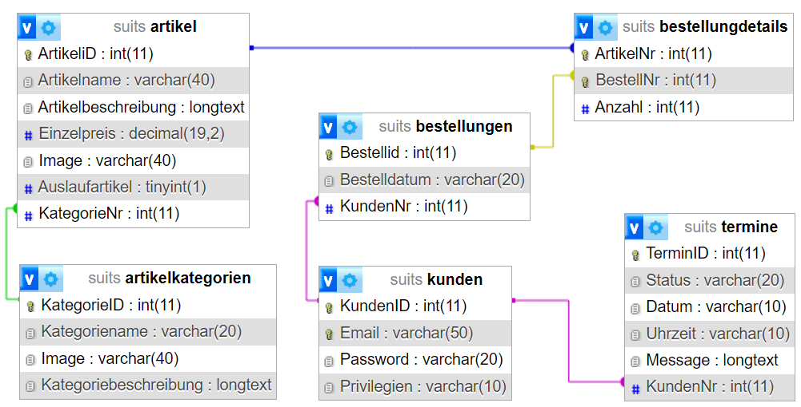

# `SPDesign`
Im Rahmen des Umschulungsmoduls `Webprojekt` wurde `SPDesign` unter Verwendung der Webtechnologien php, html, javascript, css und einer relationalen MySQL-Datenbank entwickelt.

## Projektvorgaben des Bildungsträgers
- Anbindung einer relationalen MySQL-Datenbank
  - mindestens 3 Tabellen, davon mindestens 2 mit Master-Detail-Verknüpfung
  - Primary- und Foreignkeys 
  - Beziehungen mit referentieller Integrität
- Verarbeitungslogik
  - Einbindung von php-Funktionen 
  - Javascript bei Bedarf
- Frontend
  - Struktur mit html
  - externe css
    - kein responsiv Design erforderlich
  - freie Verwendung von template-Vorlagen
- Projektdauer waren effektiv 10 Tage

## Projektvorhaben
Erstellung einer Internetpräsenz für das fiktive Unternehmen `SPDesign` als Visitenkarte
mit integriertem Webshop als Ergänzung der Unternehmen-Store.

`SPDesign` bietet maßgeschneiderte Herrenanzüge und Accessoires aus den feinsten Materialien.

## Projektziele (eigene Anforderungen)
- Erstellung des Datenbankmodells mit Sql-Anweisungen und php-Funktionen
  - ```php
    dbConnect(){}
    createDB(){}
    createTables(){}
    dropDB(){}
    dbResetAutoincrement(){}
    ```
- Trennung von Design und Logik
- Vermeidung von Redundanzen durch Trennung in  Module und Verwendung von Funktionen
  - Design
    - Unterteilung in header-, menü-, content- und footer-Bereich
  - Logik
    - Implementierung durch require/include
- Login mit captcha-Verarbeitung für Mitgliedsbereich
- Verwendung einer [html-template-Vorlage](https://templatemo.com/tm-572-designer)  zwecks...
  - Zeiteinsparung
  - Schwerpunkt und Focus auf Programmierlogik unter Verwendung von php
- Registrierte Benutzer sollen die Möglichkeit einer Terminanfrage über ein integriertes Formular erhalten
  - Verwendung der [datetimepicker](https://github.com/xdan/datetimepicker?tab=readme-ov-file)-Vorlage
- Verwendung von [bootstrap table](https://bootstrap-table.com/docs/getting-started/introduction/) 
- Versionsverwaltung mit `git`

## Database / Model



- [download](https://github.com/P76ers/SpDesign/blob/main/resources/database/suits.sql)
